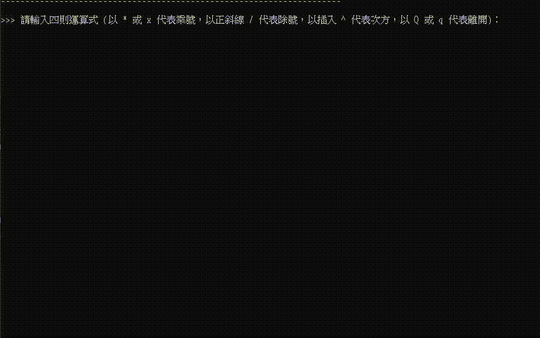

<h1 align="center">
  <br>
  [指定專題作品 (C++)] 算術的基本運算 (可處理加減乘除、次方、左右小括號之運算子)
</h1>


## 目錄
* [摘要](#摘要)
* [重點程式碼說明](#重點說明)
* [系統環境](#系統環境)
* [聯絡資訊](#聯絡資訊)
* [致謝](#致謝)
* [權限](#權限)

&nbsp;

## 摘要
### 1. 本作品具有「四則運算、次方運算及小括號之改變運算順序」的數學運算功能。
### 2. 使用者輸入資料時，系統會檢測並刪除多餘的空格，最後再進行數學運算。
### 3. 將輸出結果，寫入至輸出結果檔 (output_result.txt)，最後加以讀取並顯示其輸出結果。



<strong><em>假使想要更加了解此程式的話，請參考本頁面底部之作者的聯絡方式。</em></strong>

&nbsp;

## 重點程式碼說明
### 按照數學理論上的運算順序，加以定義「加、減、乘、除、次方 和 小括號之改變運算順序」的處理函式。
```cpp
// 預先查看運算式的下一個字元。
char peek() { … }

// 取出下一個字元。
char get() { … }

double expression();

// 當下一個字元為數字時，回傳數字 或 乘以 10 再回傳結果。
double number()
{
  double result = get() - '0';

  while (peek() >= '0' && peek() <= '9')
    ⋮

  return result;
}

// 當下一個字元為【(】、【)】、【-】字元時，則處理小括號當中的運算元，或是負號後面的運算元。
double factor()
{
  if (peek() >= '0' && peek() <= '9') return number();
  else if (peek() == '(')
  {
    ⋮

    return result;
  }
  else if (peek() == '-')
  {
    ⋮

    return -factor();
  }

  return 0;
}

// 當下一個字元為【*】、【x】、【X】、【^】、【/】字元時，則處理【*】、【x】、【X】、【^】、【/】後面的運算元。
double term()
{
  double result = factor();

  while (peek() == '*' || peek() == 'x' || peek() == 'X' || peek() == '^' || peek() == '/')
  {
    switch (get())
    {
      case '*': case 'x': case 'X':
        ⋮
          
      case '^':
        ⋮
          
      case '/':
        ⋮
    }
  }

  return result;
}

// 當下一個字元為【+】、【-】字元時，則處理【+】、【-】後面的運算元。
double expression()
{
  double result = term();

  while (peek() == '+' || peek() == '-')
  {
    if (get() == '+') 
      ⋮
      
    else 
      ⋮
  }

  return result;
}
```

&nbsp;

### 如下的主程式，可將輸出結果，寫入至輸出結果檔 (output_result.txt) 裡面。
```cpp

int main()
{
  ofstream my_file("output_result.txt");

  cout << "----------\n" << "\n\n";
  my_file << "----------\n" << "\n\n";

  while (true)
  {
    cout << "請輸入四則運算式：" << "\n\n";
    my_file << "請輸入四則運算式：" << "\n\n";

    // 接收字串並輸出
    cin.getline(input, 100);

    expression_to_parse = input;

    cout << "\n" << "您輸入的四則運算式為：" << input << "\n";
    my_file << "\n" << "您輸入的四則運算式為：" << input << "\n";

    // 輸入 Q 或 q 字元，則退出程式。
    if (input[0] == 'Q' || input[0] == 'q')
    {
      cout << 選擇退出，下次再見！！ << "\n\n";
      my_file << 選擇退出，下次再見！！ << "\n\n";
      break;
    }

    int p, q, r;
    char arr[] = "1234567890+-*/xX^() ";

    q = (int) strlen(input);
    r = 0;

    for (p = 0; p < q; p++)
    {
      char* z = find(arr, arr + strlen(arr), input[p]); // find input[p]
      // 判別：如果輸入未允許的字元，則 r 等於 1。
      if (z == arr + strlen(arr))
      {
        r = 1;
        break;
      }
    }

    // 判別：如果 等於 = 1，則輸出運算結果。
    if (r == 1)
    {
      cout << "輸入錯誤，請重新輸入。" << "\n\n";
      my_file << "輸入錯誤，請重新輸入。" << "\n\n";
    }

    // 判別：如果輸入皆為允許字元，則輸出運算結果。
    else
    {
      # 去除輸入字串中的空格，並計算空格的數量。
      int i, j;
      int counter = 0;

      for (i = 0, j = 0; input[i]; i++)
      {
        if (input[i] == ' ') counter++;
        else
        {
          ⋮
        }
      }

      input[j] = '\0';

      // 開始運算。
      double result = expression();

      cout << "您所輸入的空格數量：" << counter << "\n";
      cout << "調整後的四則運算式與計算結果：" << input << " = " << result << "\n\n";
      cout << "----------" << "\n\n";

      my_file << "您所輸入的空格數量：" << counter << "\n";
      my_file << "調整後的四則運算式與計算結果：" << input << " = " << result << "\n\n";
      my_file << "----------" << "\n\n";
    }
  }

  my_file.close();
}
```

&nbsp;

### 讀取並顯示其輸出結果檔 (output_result.txt) 的內容。
```cpp
cout << "\n" << "以下將讀取其輸出結果檔，並顯示其內容：" << "\n\n";

ifstream my_read_file("output_result.txt");

⋮

cout << "\n" << "輸出結果檔的內容，已經被讀取完畢。" << "\n\n";

my_read_file.close();
return 0;

```

&nbsp;

## 系統環境
### 本程式所在作業系統
* OS：Windows 7 / 10 (Mac OS、Linux 系統亦可相容)


### 相關套件
* C++ 核心

&nbsp;

## 聯絡資訊
👤 **Larry Jhuang**
  * Email: larry30500@gmail.com

&nbsp;
 
## 致謝
*非常感謝指導老師 (Francesco Ke) 提供程式設計的靈感和方向，並充分教導程式設計的注意事項和相關細節。*

*如果您喜歡此專案，記得點擊⭐️支持作者。*

&nbsp;

## 權限
目前設定為 MIT 權限。請參閱 `LICENSE`，了解更多相關 MIT 權限的規定。

&nbsp;

[[ 返回目錄 ]](#目錄)

